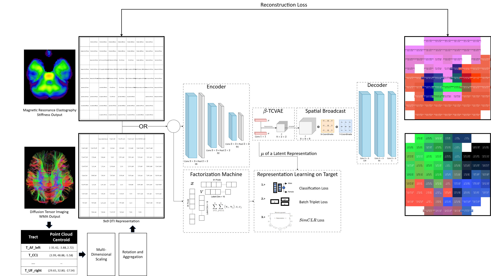

# DTI 2D Representation

The model learns an interpretable and disentangled representation from Diffusion Tensor Imaging.



## Project Structure

```
DTI_2D_representation/
├── Backbone/                    # Core model implementations
│   ├── Multimodal_backbone.py   # Multimodal backbone architecture
│   ├── DTI_autoencoder.py       # DTI autoencoder implementation
│   └── Training_function.py     # Training utilities
│
├── Dataset/                     # Data storage
│   ├── aggregated_grid.npy      # 2D aggregated grid data
│   └── aggregated_grid_3D.npy   # 3D aggregated grid data
│
├── Processing/                  # Data processing notebooks
│   ├── synthetic_dti_dataset.ipynb    # Synthetic dataset generation
│   ├── dti_2D_representation.ipynb    # 2D representation processing
│   └── dti_3D_representation.ipynb    # 3D representation processing
│
├── Autoencoder_DTI_AuxClassifier.ipynb  # Auxiliary classifier implementation
├── Autoencoder_DTI_SimCLR.ipynb        # SimCLR implementation
├── Autoencoder_DTI_Triplet.ipynb       # Triplet loss implementation
├── arch_figure.png                     # Architecture diagram
└── README.md                           # Project documentation
```
## Contributing

Contributions are welcome! Please feel free to submit a Pull Request.

## License

This project is licensed under the MIT License - see the LICENSE file for details.
